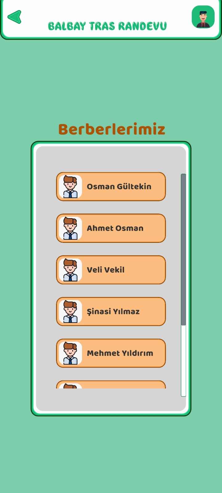

# BarberAppointment

# 💈 Unity Barber Appointment System

This project is a **barbershop appointment system** built using **Unity** for the front-end and **MySQL + PHP** for the back-end.
I did the front-end (Unity) of this project given by our university professor, my friend did the back-end (MySQL). I did PHP with GPT :)
Of course there are deficiencies in this project that we did in about a week. You can reach the details below or by downloading. Good luck.

## 📁 Project Structure

## 🔧 Technologies Used

- Unity (C#)
- PHP (for backend API)
- MySQL (database)
- XAMPP (local server for testing)

## 🚀 How to Run
### 1. Backend (PHP & MySQL)

1. Install **XAMPP** and start Apache + MySQL.
2. Place the `/api` folder inside `htdocs`.
3. Import `berberrandevusistemi.sql` into phpMyAdmin to create the database.

### 2. Frontend (Unity)

1. Open `/BarberAppointment` in Unity Editor.
2. Make sure the IP address in API URLs points to your local server IP (e.g., `http://192.168.1.100/api/...`).
3. Run the app in Unity or build it for Android/Windows.
4. Download "DOTween (HOTween v2)" from Package Manager (free)
5. Author of Multi Touch Scroll Rect (You can also use normal scrollrect, but this is my choice for the phone.): https://stackoverflow.com/questions/56221113/fix-for-scrollrect-multi-touch-in-unity/74451909#74451909
6. You can use some assets from Kenny (https://kenney.nl/assets/ui-pack)

## 🧪 Features

- User registration & login
- Appointment listing & booking
- Barber rating and comment system
- Available times shown dynamically

## 📸 Screenshots

## 📄 License - MIT

This project is open source and free to use.

